# Docker Homework - Практическое применение Docker

**Выполнил:** Дудников Даниил 

## Структура репозитория

```bash
shvirtd-example-python/
├── Dockerfile.python          # Multistage сборка
├── compose.yaml               # Docker Compose конфигурация
├── .dockerignore              # Исключения для Docker
├── .gitignore                 # Исключения для Git
├── deploy.sh                  # Скрипт развертывания
├── README.md                  # Документация
└── ... (оригинальные файлы репозитория)
```

---

## задание 0 - Проверка версий Docker Compose

- `docker-compose` (с дефисом) - не установлен, команда не найдена
- `docker compose` (без дефиса) - версия v5.1.3

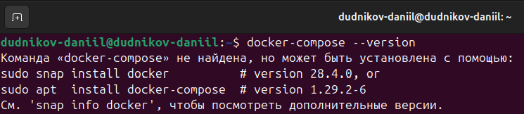
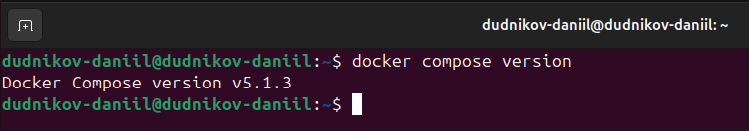

---

## задание 1 - Dockerfile.python и multistage сборка

Создан `Dockerfile.python` с multistage сборкой:
- Stage 1: Builder - установка зависимостей
- Stage 2: Runtime - копирование собранных пакетов и запуск приложения

Добавлены файлы в репозиторий:
- `Dockerfile.python`
- `compose.yaml`
- `.dockerignore`
- `.gitignore`
- `deploy.sh`

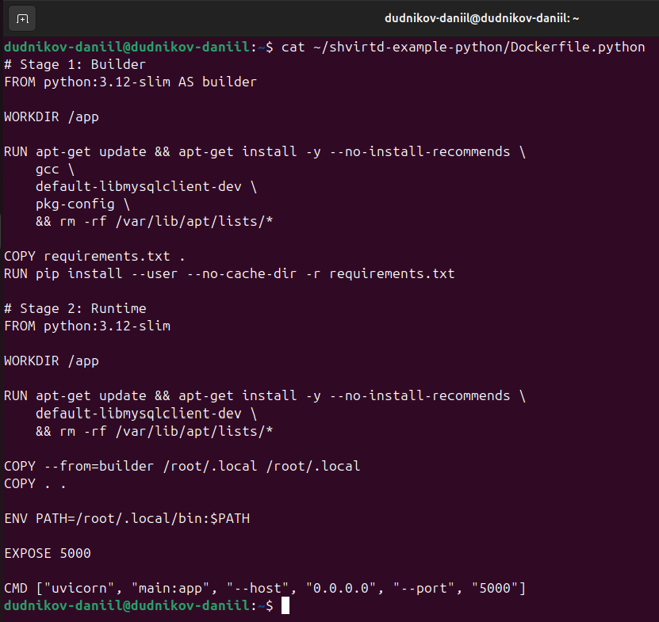
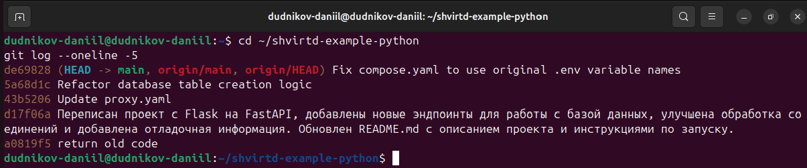

---

## задание 2 - Yandex Cloud Container Registry

- Создан Container Registry с именем `test`
- Образ собран и загружен: `cr.yandex/crpevagkvisif5n8oq9k/test:latest`
- Выполнено сканирование на уязвимости:

| Уровень | Количество |
|---------|------------|
| High    | 48         |
| Medium  | 344        |
| Low     | 153        |

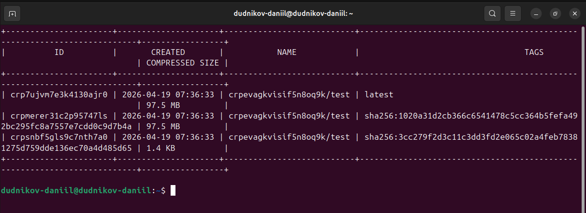
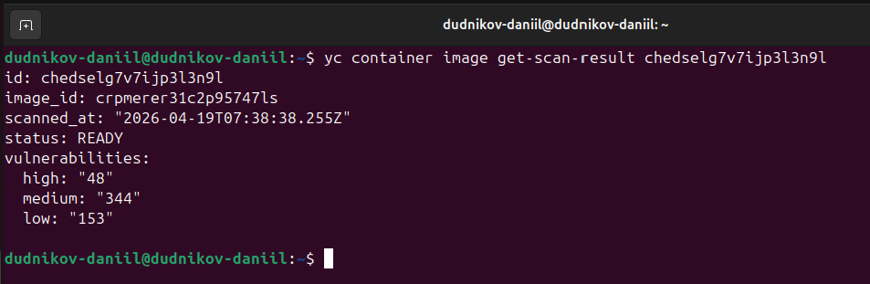

---

## задание 3 - Docker Compose и работа сервиса

Создан `compose.yaml` с сервисами:
- `web` - FastAPI приложение (IP: 172.20.0.5)
- `db` - MySQL 8 (IP: 172.20.0.10)
- Настроена bridge-сеть `backend`

**Проверка работы:**

```bash
curl -L http://127.0.0.1:8090
```

**Результат:** `"TIME: 2026-04-19 08:34:42, IP: 127.0.0.1"`

**Данные в MySQL:**

```bash
docker exec -it shvirtd-db mysql -uroot -pYtReWq4321 -e "USE virtd; SELECT * FROM requests LIMIT 5;"
```

| id | request_date | request_ip |
|----|--------------|------------|
| 1 | 2026-04-18 15:29:55 | 127.0.0.1 |
| 2 | 2026-04-18 15:33:35 | 127.0.0.1 |
| 3 | 2026-04-18 15:34:54 | 127.0.0.1 |

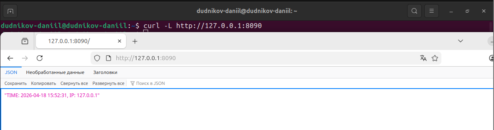
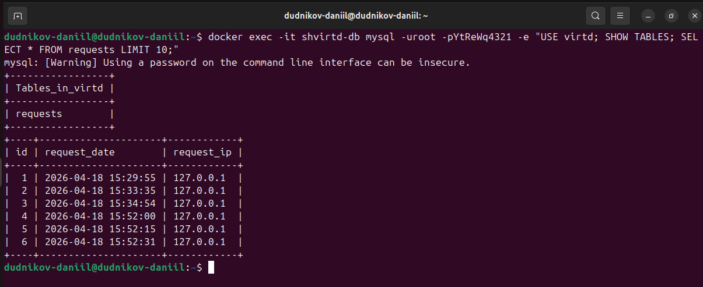

---

## задание 4 - Развертывание в Yandex Cloud

**Параметры ВМ:**
- Имя: `docker-vm`
- Зона: `ru-central1-a`
- Память: 2 ГБ
- Процессор: 2 vCPU
- ОС: Ubuntu 22.04 LTS
- Внешний IP: `111.88.244.133`

**Проверка с локальной машины:**

```bash
curl -L http://111.88.244.133:8090
```

**Результат:** `"TIME: 2026-04-19 08:34:42, IP: 81.3.189.20"`

**Проверка через check-host.net:**
- Успешные ответы из 30+ стран мира
- HTTP статус: 200 OK

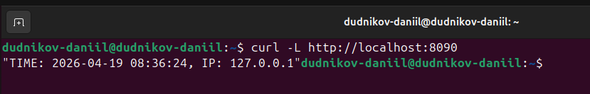
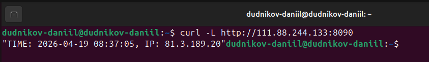
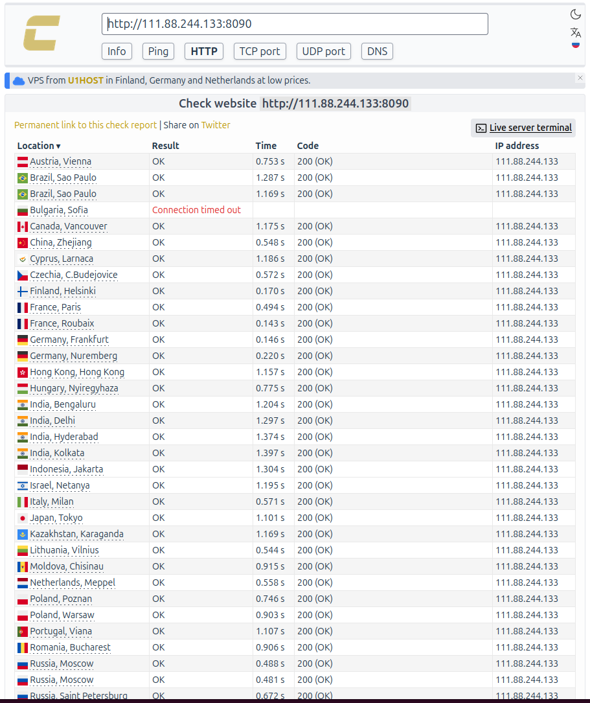
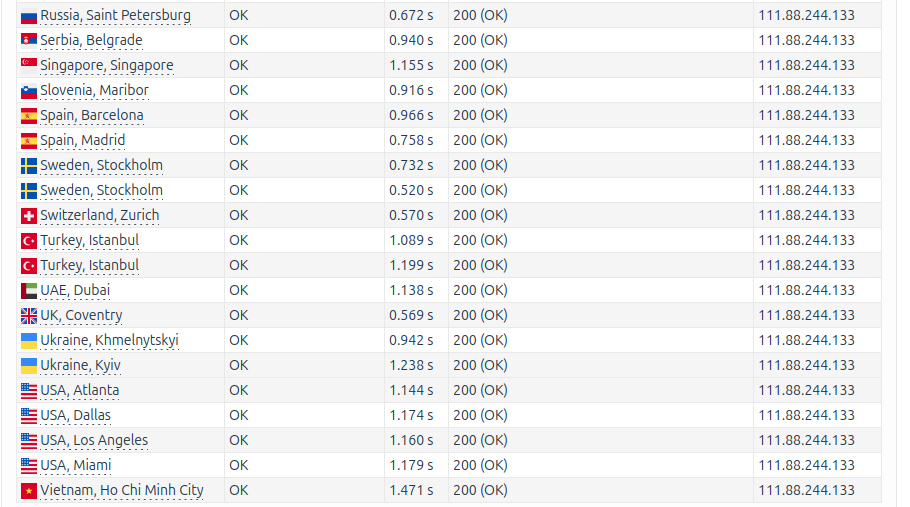

---

## задание 6 - Анализ образа через dive

- Установлен инструмент `dive`
- Проанализирован образ `hashicorp/terraform:latest`
- Найден слой с бинарным файлом terraform

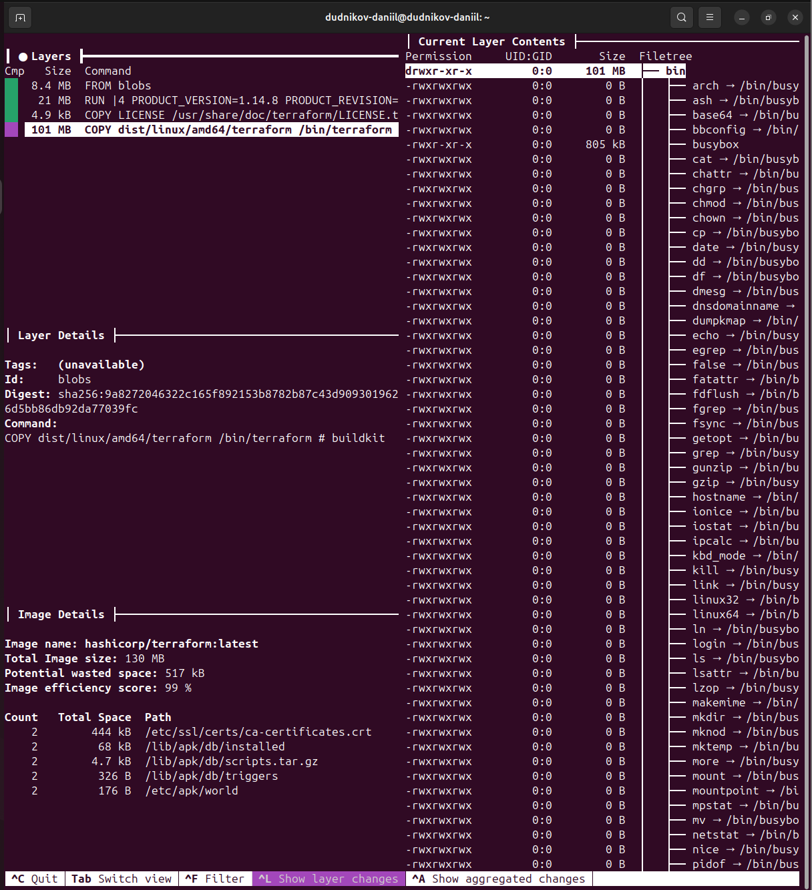

---

## задание 6.1 - Извлечение terraform через docker cp

```bash
docker run -d --name temp-terraform hashicorp/terraform:latest
docker cp temp-terraform:/bin/terraform ./terraform
./terraform version
```

**Результат:** `Terraform v1.14.8 on linux_amd64`

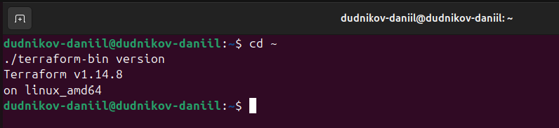

---

## задание 6.2 - Извлечение terraform через docker build (необязательное)

Создан специальный Dockerfile:

```bash
FROM hashicorp/terraform:latest AS source
FROM scratch
COPY --from=source /bin/terraform /terraform
```

**Результат:**

```bash
./terraform-from-build version
# Terraform v1.14.8 on linux_amd64
```

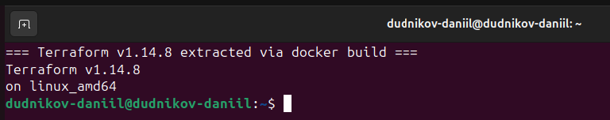

---

## Запуск проекта

```bash
git clone https://github.com/DudnikovDaniil/shvirtd-example-python.git
cd shvirtd-example-python
docker compose up -d
curl -L http://localhost:8090
docker compose down
```

## Ссылки

- [GitHub репозиторий](https://github.com/DudnikovDaniil/shvirtd-example-python)
- [Исходный репозиторий](https://github.com/netology-code/shvirtd-example-python)


